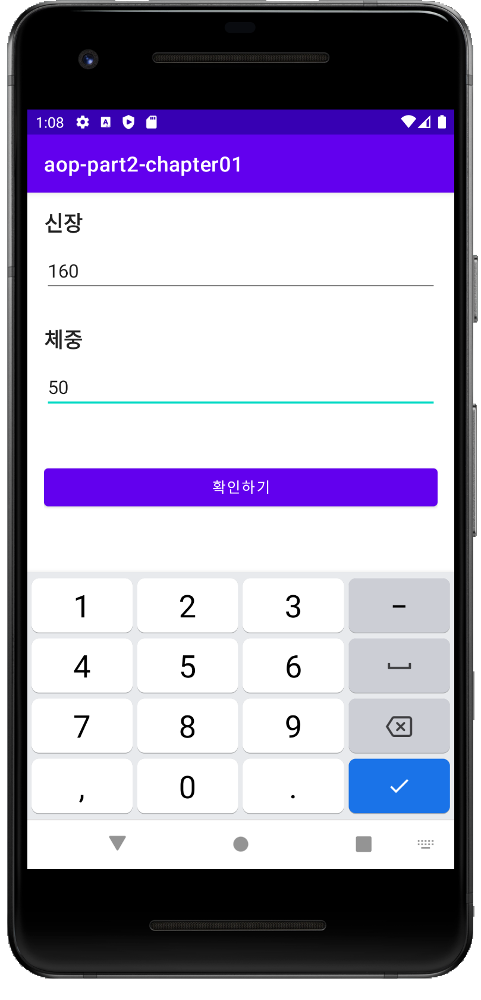
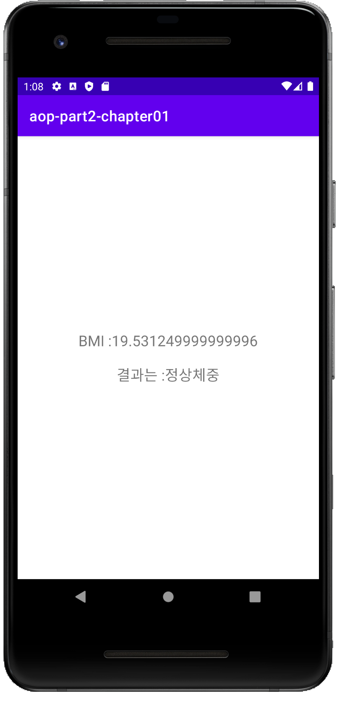

# Aop-part2-chapter01 - BMI 계산기


# 목차

1. 인트로 (완성앱 & 구현 기능 소개)
2. Linearlayout 이용하여 화면 그리기
3. 화면을 이쁘게 꾸며보기
4. 키와 몸무게 입력 화면 기능 구현하기 (1)
5. 키와 몸무게 입력 화면 기능 구현하기 (2)
6. 결과화면 기능 구현하기
7. 아웃트로 (정리)


# 결과화면







# 이 챕터를 통해 배우는 것

- **Layout** 을 그리는 법
  - **LinearLayout** 사용하기
  - **TextView** 의 속성들과 사용하는 법
  - **EditText** 의 속성들과 사용하는 법
  - **Button** 사용하는 법
- **Layout** 과 **Kotlin** 코드를 함께 사용하기
- **버그** 수정해보기
- **Activity** 에 대해 알아보기


### Kotlin 문법

when 분기문

람다함수

public static void printEvenNumbers(int[] numbers) {
Arrays.stream(numbers)
.filter(n -> n % 2 == 0)
.forEach(System.out::println);
}


### BMI 계산하기

공식 =  몸무게(kg) / (키 (m) * 키 (m)) 

18.5 이하면 저체중

18.5 ~ 23 은 정상체중

23 ~ 25는 과체중

25 ~ 30 은 경도 비만

30 ~ 35 는 중정도비만

35 이상은 고도 비만

###학습한것 

##view<br>
#객체
```
    Button
    EditText
    TextView
   ```
#속성
```
    android:padding="16dp"
    android:layout_marginTop="10dp"'
    android:text="@string/height"
    android:inputType="number"
    android:textColor="@color/custom_black"
    android:textSize="20sp"
    android:textStyle="bold"
    android:ems="10"
```

##controller
# id값으로불러온다
        val heightEditText: EditText = findViewById(R.id.heightEditText)
        val weightEditText = findViewById<EditText>(R.id.weightEditText)

        val resultButton = findViewById<Button>(R.id.resultButton)
#팅기게한다        
      `  return@setOnClickListener`

#통신방법
            val height: Int = heightEditText.text.toString().toInt()
            val weight: Int = weightEditText.text.toString().toInt()

            val intent = Intent(this, ResultActivity::class.java)

            intent.putExtra("height", height)
            intent.putExtra("weight", weight)

            startActivity(intent)

#받는방법

        val height = intent.getIntExtra("height", 0)
        val weight = intent.getIntExtra("weight", 0)

        Log.d("ResultActivity", "height : $height , weight : $weight")


##setting

#manifests<>
        `<activity android:name=".ResultActivity"/>`

